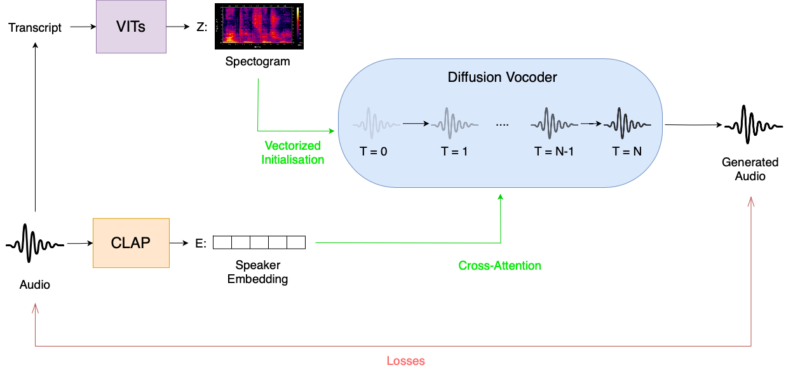
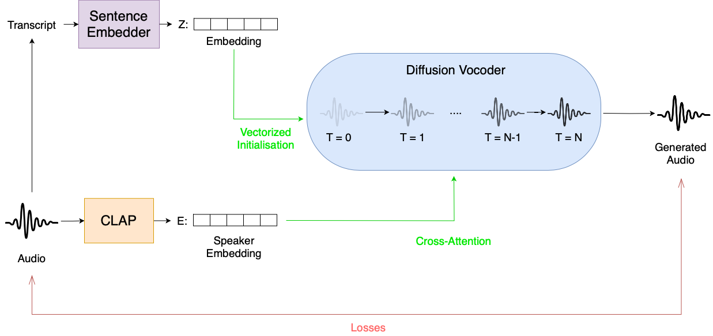
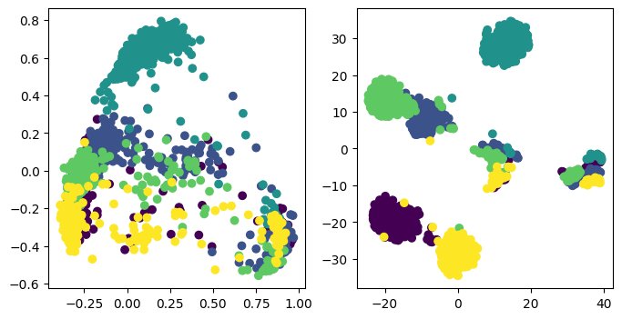

# Conditional-Diffusion-Audio

This repository contains the code of various experiments on conditioned Diffusion based Text-To-Speech generation.

## Goal

Generate expressive speech samples given an input transcipt and some guidance vector.
We experiment by controlling the diffusion process via Cross-attention over [CLAP](https://github.com/microsoft/CLAP) / [ImageBind](https://github.com/facebookresearch/ImageBind) speaker embeddings. 
We first embedd the original audio signal by using a pretrained embedding model, obtaining a speech embedding which we show to be disentagnled from the content of the speech.
The speech content is then controlled by the input transcript/original spectogram.
By emplying a stochastic diffusion process for speech generation, we aim at diveristy in the generated samples while allowing for flexibility in speaker identity by conditional embedding guidance.

## Experiments

We ran the following experiments:

- Spectograms + CLAP Embeddings -> Audio



- Sentence Embedidng + CLAP Embeddings -> Audio



- Phoneme Embedding + CLAP Embeddings -> Audio


Additionally we also show that while Spectogram to SPectrogram generation using Audio diffusion Diffusion works, deplying a pretrained Vocoder (eg. VITS) doens't allow for speaker id transfer and novel voice generation. 
More details on this issues can be found int the [extensive report](assets/VITS_Adding_Control.pdf) from the MSc student Mathias Vogel.


## Speaker disentagnlement in ImageBind / CLAP latent space

We show how the audio embeddings of pretrained models such as CLAP or ImageBind preserve speaker identity and are agnostic to actual speech content. 

Proving the robustness of such models over content changes in the input audios, allows us to demostrate how these embeddings can be considered as a style representation of individual voices.

This allows for clustering in the embedding space and most importanlty renders these embedding spaces as strong candidates for audio-generation conditioning.

Code for speaker embedding using ImageBind and CLAP can be found in the subdirectory: ```ImageBind```.

Here are also some results of speaker clustering:

- CLAP 



- ImageBind


## Prerequisites
- Python >= 3.7
- Pytorch with cuda (tested on 1.13)
- VITS installation including monotonic_align

## Installation
```bash
pip install torch torchvision torchaudio
pip install -r requirements.txt
pip install -e ./audio-diffusion-pytorch
pip install -e ./a-unet
```

## Running the experiments
Set up a config file in the ```configs``` folder.
You can then run the training with the following:
```
python train_vocoder.py --config $PATH_TO_CONFIG_FILE
```

